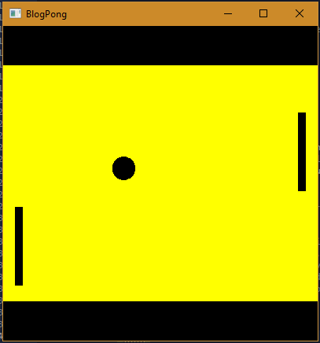

##Haskell Error fare web scraper development blog
Deze blog is gemaakt om inzicht te geven in mijn poging om een ​​pongspel te maken.
Mijn eerste idee was om een ​​webschraper te maken, maar door een gebrek aan gratis API's en de aanhoudende Covid-19-uitbraak (die ik destijds had) werd dit doel binnen de gestelde deadline onbereikbaar.

## Day 1: Choosing which language
written on 05-03-2020

### Goals
Eerst wil ik enkele basisfunctionaliteiten in de taal leren. Dus syntax en andere dingen die de taal uniek maken,
Als eindresultaat wil ik een pong game maken waar ik met twee spelers kan spelen. De eisen zijn dat het speelbaar is tussen twee personen
daarnaast wil ik andere functionaliteiten inbouwen als ik eraan toe kom, zoals het tonen van de score, een AI of meerdere niveaus.
Later in deze blog kom je erachter dat dit moeilijker dan gedacht was en ik mijn verwachtingen moest verlagen

### So... Why Haskell?
After programming this simple pong game i'd like to have a basic understanding of the functional programming paradigm.
To archieve this I looked for a language which had almost no imperative paradigm support to prevent myself from 'accidently' programming an imperative program
Secondly I'd like to choose a language that has a good community, so i could look somewhere for help.
Michell recommended to try Haskell, and after doing a little research it suited al my needs. It is imperative and has a big community. 
The Sytax looks hard, but is not impossible when i wrap my head around it.


## Day 0: Setting up the project
Written on 06-03-2020

### Build tool, package manager and IDE

Ik zal Stack gebruiken als de build-tool, dit creëert een lokale omgeving, te vergelijken met PIP(Python) een standaard projectstructuur.
Als IDE gebruikte ik Intellij met de Intellij-haskell plug-in. Echter,
het doel van deze blog is om te wijzen op verschillen in de programmeertaal zelf. NIET de packagemanager. Daarom zal ik hier niet verder op in gaan.
Ik gebruik deze (http://andrew.gibiansky.com/blog/haskell/haskell-gloss/) tutorial om me te begeleiden bij het maken van pong.

## Day 1: Start
geschreven op 10-03-2020

Tijdens de eerste fase ben ik aan de slag gegaan met het kijken van een video, https://www.youtube.com/watch?v=02_H3LjqMr8&t=4060s 
om alle ins en outs van de taal te leren. Daarin vielen mij een aantal dingen op waarop ik hierna dieper zal ingaan.

#### Eigenschappen
* Lazy, Items worden niet geladen zolang ze niet nodig zijn, in `zeroToTen = [0..10]` wordt de 9 pas berekend wanneer het nodig is
* Loops niet mogelijk, tenzij recursive.
* volgorde maakt niet uit.
* sommige imperatieve operaties mogelijk door monads.

#### Datatypes
* net zoals java/js hoeven datatypes niet gedefinieerd te worden (wel aan te raden op root scopeniveau)
* Integer wordt meest gebruikt, int heeft vastgestelde max waarde
* negatieve nummers moeten met haakjes omringd zijn
* Lists
    * Singly linked
    * Veel operatoren
    * Hoop dingen mogelijk, zoals het volgende
        ```
          -- You could perform operations on all values in a list
            -- Cycle through the list storing each value in x which is multiplied by 2 and then stored in a new list
            listTimes2 = [x * 2 | x <- [1..10]]
      
          -- Generate a multiplication table by multiplying x * y where y has the values
          -- 1 through 10 and where x does as well
             multTable = [[x * y | y <- [1..10]] | x <- [1..10]]
        ```
    * Ook filters op lists mogelijk zoals sort
    Via `map`  kan er een functie op ieder item in een lijst worden uitgevoerd
* Tupels
    * Via tupels kunnen meerdere datatypen worden gecombineerd, bijvoorbeeld `persoon = ('Sven', 23)`
    * Een list kan ook uit tupels bestaan `Personen = [(Sven, 23), (Michel, 28)]` :p
    * via zip kunnen lijsten met twee datatypes gecombineerd worden in een lijst met tupels, bestaande uit twee datatypen.
* Custom Types
    * Voorbeeld: Onderstaand voorbeeld laat ook zien dat de alleen de naam nodig is binnen een struct om een van de waardes te vinden (in voorbeeld het saldo van tom smith)
    ```
    -- ---------- CUSTOM TYPES ----------
    -- multiple values in sort of struct to create custom types
    data Customer = Customer String String Double
    	deriving Show
    	
    -- Define Customer and its values
    tomSmith :: Customer
    tomSmith = Customer "Tom Smith" "123 Main St" 20.50
     
    -- Define how we'll find the right customer (By Customer) and the return value
    getBalance :: Customer -> Double
    getBalance (Customer _ _ b) = b
     
    tomSmithBal = print (getBalance tomSmith)
    ```
  * Alle type waardes kunnen worden geprint met `show`

#### Functies
* Functies kunnen worden meegegeven aan andere functies.
* Dezelfde logische operatoren kunnen gebruikt worden als in andere talen `TRUE, FALSE, !, ||, not`
    * De `$` operator zorgt ervoor dat alles wat na de operator komt belangrijker is dan hetgene wat ervoor komt.
      ```
      putStrLn (show $ 1 + 1)
      putStrLn $ show (1 + 1)
      putStrLn $ show $ 1 + 1
      ```
    * de `.` operator kan functies aan elkaar voegen, de output van de ene functie kan gebruikt worden door de andere functie.
      ```
      (putStrLn . show) (1 + 1)\
      ```
* Veel recursie: https://youtu.be/02_H3LjqMr8?t=2782
    Voorbeeld:
    ```
   -- Check if strings are equal with recursion
         areStringsEq :: [Char] -> [Char] -> Bool
         areStringsEq [] [] = True
         areStringsEq (x:xs) (y:ys) = x == y && areStringsEq xs ys
         areStringsEq _ _ = False
   --  tuples : addTuples (1,2) (3,4) = (4,6)
       addTuples :: (Int, Int) -> (Int, Int) -> (Int, Int)
       addTuples (x, y) (x2, y2) = (x + x2, y + y2)
    ```
* Een functie kan gebruik maken van `where` de code die daarin staat wordt uitgevoerd voor het berekenen van de return.
* if statements niet veel gebruikt

* Overriden van functies als volgt:
    ```
    instance Eq ShirtSize where
    	S == S = True
    	M == M = True
    	L == L = True
    	_ == _ = False
     
    instance Show ShirtSize where
    	show S = "Small"
    	show M = "Medium"
    	show L = "Large"
    ```

#### Modules
* Om een programma op te delen kan gebruik worden gemaakt van modules. Deze kunnen geïmporteerd worden in een programma.
  Ik zie ze graag als een class.


##Day 3:
geschreven op 14-3-2020

Op deze dag ben ik aan de slag gegaan met het doorlopen van de aanwijzingen uit deze(http://andrew.gibiansky.com/blog/haskell/haskell-syntax/) inleiding op haskell.
Ik heb verschillende getoonde codefragmenten zelf uitgevoerd en heb nagedacht hoe ze zouden werken. Vervolgens keek ik in het artikel om te zien of ik het bij het juiste eind had. 

Ik kwam er zelf achter dat ik grote moeite had met het zelfstandig lezen en maken van de code. Dit komt omdat haskell fundamenteel anders werkt dan imperatieve talen. 
Ook had ik grote moeite met de syntax zelf, ik haalde voordurend dingen door elkaar omdat de syntax zo ontzettend veel verschilt.
Aan het begin vond ik functies lastig, en toen ik doorhad hoe functies werkten kwam ik er later achter dat ik het nog steeds niet goed begrepen had.

De syntax is vooral lastig doordat het moeilijk is dingen uit elkaar te halen(gebrek aan haakjes) en verschillende manieren om iets te doen. een `.` is bijvoorbeeld toegestaan om verschillende parameters achter elkaar te zetten zonder haakjes te gebruiken. 
Maar ook het gebruik van `$` zorgt ervoor dat de volgorde van parameters kunnen veranderen.
Daarnaast is het voor mijn gevoel 'raar' om een waarde niet direct aan te kunnen passen

Ik kan echter niet ontkennen dat er een aantal concepten in de taal zitten die ontzettend handig zijn, neem bijvoorbeeld een list, verschillende operatoren en de manier waarop recursie werkt.

Dit is ook het punt waarop ik van mijn orginele plan (het opzetten van een low-fare finder) afzie. 
Ik ben namelijk tot de conclusie gekomen dat iets van scratch maken waarbij er geen API's beschikbaar zijn en geen voorbeelden erg optimistisch was.
Ik denk dat ik op dit moment voldoende handvaten heb om via een tutorial een eigen pong game te maken. 


##Day 4: Setting up the UI
geschreven op 15-3-2020

Om te beginnen heb ik het gloss package via stack geïnstalleerd. Ik heb er bewust voor gekozen om het hele programma in één module te schrijven. Namelijk de `main`
Bij het aanmaken van de window had ik al last met de syntax. Ik moest een Display object aanmaken van het type inWindow, deze krijgt een aantal parameters mee, twee tuples. 
Uiteindelijk moest dit weer worden meegegeven aan de `main` functie die er op zijn beurt weer een `display`, `window `, `background` en `drawing` object mee.
Ik snapte echter niet waarom de syntax zo verwarrend is aangezien het een stuk duidelijker kan zijn wanneer de display functie haakjes zou hebben om de scope duidelijk te maken.

``` 
module Main(main) where

import Graphics.Gloss

window :: Display
window = InWindow "Nice Window" (200, 200) (10, 10)

background :: Color
background = white

drawing :: Picture
drawing = circle 80

main :: IO ()
main = display window background drawing <- Waarom???
```
Daarna ben ik aan de slag gegaan met het verder uitbouwen van de UI, Daarbij heb ik een aantal globale variabelen aangemaakt, 
Deze variabelen zorgen dat de groote van de bal, het speelveld, en batjes makkelijk aangepast kunnen worden.
```
-- | GENERAL SETTING
width, height, offset :: Int
width = 400
height = 400
offset = 200
window :: Display
window = InWindow "BlogPong" (width, height) (offset, offset)
background :: Color
background = yellow
paddleWidth, paddleHeight, paddleDistance, ballRadius :: Float
paddleWidth = 10
paddleHeight = 100
paddleDistance = 180
ballRadius = 15

fps :: Int
fps = 60

```
Vervolgens heb ik een gamestate gemaakt in de vorm van een tupel, in deze gamestate staat precies aangegeven in welke staat het spel op een bepaald moment is.

```
data PongGame =
  Game
    { ballLoc :: (Float, Float) -- Pong ball (x, y) location.
    , ballVel :: (Float, Float) -- Pong ball (x, y) velocity.
    , player1 :: Float -- ^ Left player paddle height.
    , player2 :: Float -- ^ Right player paddle height.
    }
  deriving (Show)
```
daarna heb ik een render functie gemaakt die deze tupel accepteert en de game aanpast naar de data in de tupel.
Een wijziging in deze tupel moet dan ook voldoende zijn om de locatie/richting van de bal aan te passen

De structuur van de functie is erg interessant, eerst wordt aangeveven dat de functie een aantal pictures teruggeeft in de vorm van een list, 
maar vervolgens geeft het aan dat deze pictures een bepaalde waarde hebben. Op het eerste gezicht vond ik dit onprettig, maar later vind ik het toch fijn om op deze manier te werken.

```
-- | Convert a game state into a picture.
render ::
     PongGame -- ^ The game state to render.
  -> Picture -- ^ A picture of this game state.
render game =
  pictures [ball, walls, mkPaddle black paddleDistance $ player1 game, mkPaddle black (-paddleDistance) $ player2 game]
    --  The pong ball.
  where
    ballSize = ballRadius
    ballColor = black
    ball = uncurry translate (ballLoc game) $ color ballColor $ circleSolid ballSize
    --  The bottom and top walls.
    wall :: Float -> Picture
    wall offset = translate 0 offset $ color wallColor $ rectangleSolid 400 50
    wallColor = black
    walls = pictures [wall 175, wall (-175)]
    --  Make a paddle of a given border and vertical offset.
    mkPaddle :: Color -> Float -> Float -> Picture
    mkPaddle col x y =
      pictures
        [ translate (x) (y) $ color col $ rectangleSolid paddleWidth paddleHeight
        , translate (x) (y) $ color col $ rectangleSolid paddleWidth paddleHeight
        ]
    paddleColor = light (light blue)
    
-- | The starting state for the game of Pong.
initialState :: PongGame
initialState = Game {ballLoc = (-10, 30), ballVel = (-100, -30), player1 = 40, player2 = -80}
```
De tupel heb ik aangepast door de volgende functie te maken, deze pakt de data uit de gamestate en returnt een nieuwe gamestate waarbij de data aangepast is. 
Op deze manier kan de bal bewegen. 
```
moveBall ::
     Float -- ^ The number of seconds since last update
  -> PongGame -- ^ The initial game state
  -> PongGame -- ^ A new game state with an updated ball position
moveBall seconds game = game {ballLoc = (x', y')}
    -- Old locations and velocities.
  where
    (x, y) = ballLoc game
    (vx, vy) = ballVel game
    -- New locations.
    x' = x + vx * seconds
    y' = y + vy * seconds
```

Dit heb ik aan elkaar vastgemaakt door de main functie en een update functie te maken, daar kom ik echter aan het einde van mijn blog op terug omdat daar nog wijzigingen in komen.

## Day 5: Gamestate aanpassen en collision detection
18-3-2020

Op dit moment heb ik een game die het volgende doet: een spelomgeving maken, en een bal laten bewegen. De bal stopt echter niet bij de batjes en raast er gewoon doorheen, ik had iets nodig om de bal tegen de muur en batjes aan te laten stuiteren.
Om dat voor elkaar te krijgen moest ik detecteren of de bal verder is dan de wall en vervolgens de velocity aanpassen.


```

-- | Detect a collision with one of the side walls. Upon collisions,
-- update the velocity of the ball to bounce it off the wall.
wallBounce :: PongGame -> PongGame
wallBounce game = game {ballVel = (vx, vy')}
    -- Radius. Use the same thing as in `render`.
    -- The old velocities.
  where
    (vx, vy) = ballVel game
    vy' =
      if wallCollision (ballLoc game) ballRadius
             -- Update the velocity.
        then -vy
            -- Do nothing. Return the old velocity.
        else vy

type Radius = Float

type Position = (Float, Float)

-- | Given position and radius of the ball, return whether a collision occurred.
wallCollision :: Position -> Radius -> Bool
wallCollision (_, y) radius = topCollision || bottomCollision
  where
    topCollision = y - radius <= -fromIntegral width / 2 + 50
    bottomCollision = y + radius >= fromIntegral width / 2 - 50
```
Dit heb ik vervolgens ook gedaan voor de paddles, deze waren echter een stuk lastiger omdat daar een stuk rekenwerk bij komt kijken.
Ik heb dit dus uiteindelijk opgezocht in een andere uitwerking en op een zelfde manier geimplementeerd in mijn uitwerking.

Vervolgens ben ik aan de slag gegaan met het afhandelen van de input, deze moest ervoor zorgen dat de paddles kunnen bewegen.
Dit kon ik doen door gebruik te maken van de play function uit gloss. Deze functie accepteert leek erg op `simulate` functie die ik eerder heb gebruikt maar accepteert een functie die User input afhandeld.
Omdat Haskell functies accepteert als parameter kan dit op een erg simpele manier worden afgehandeld.

```
-- | Respond to key events.
handleKeys :: Event -> PongGame -> PongGame
handleKeys (EventKey (Char 'r') _ _ _) game = game {ballLoc = (0, 0)}
--handleKeys (EventKey (Char 'w') _ _ _)
--
--  game = game {player1 = ()}
handleKeys (EventKey (SpecialKey KeyUp) _ _ _) game = game {player1 = y}
  where
    y1 = player1 game
    y =
      if y1 < (100)
        then y1 + 10
        else y1
```

###Alles aan elkaar knopen
21-3-2020

Om alles op een goede manier te laten werken moeten alle functies aan elkaar geknoopt worden in een globale functie, 
dit heb ik gedaan door de main functie de `gloss.play` functie mee te geven 
In deze functie wordt de kracht en zwakte van Haskell goed duidelijk...
```
| play                         | Description                                                                                                       |
|------------------------------|------------------------------------------------------------------------------------------------------------------|
| :: Display                   | Display mode.                                                                                                    |
| -> Color                     | Background color.                                                                                                |
| -> Int                       | Number of simulation steps to take for each second of real time.                                                 |
| -> world                     | The initial world.                                                                                               |
| -> (world -> Picture)        | A function to convert the world a picture.                                                                       |
| -> (Event -> world -> world) | A function to handle input events.                                                                               |
| -> (Float -> world -> world) | A function to step the world one iteration. It is passed the period of time (in seconds) needing to be advanced. |
| -> IO ()                     |                                                                                                                  |
```
Onderstaand stukje code is de manier hoe ik de functie aanroep.
```
main :: IO ()
main = play window background fps initialState render handleKeys update
```
Wat handig is is dat functie kunnen worden meegegeven aan andere functies, het is echter niet duidelijk wat die andere functies ermee doen zonder documentatie erbij te halen.
Ik zat zelf erg lang erop vast dat ik niet snapte hoe ik de update functie zijn secondes kon doorgeven, deze kon ik er namelijk niet achter zetten. omdat de play functie maar 8 argumenten accepteert.
Ook is het verwarrend dat er geen scheiding zit tussen functies en variablen, in het voorbeeld`main = play window...` is het mij niet direct duidelijk dat window een argument is van play en zou snel voor verwarring zorgen.
Na het erbij halen van de documentatie kwam ik er achter dat de play functie intern pas iets doet met de update functie.
Ik denk dat meer mensen met een imperatieve achtergrond daar een probleem hebben, het zorgt voor een 'black box' tenzij je precies weet waar de functie voor dient.
De reputatie dat Haskell 'magisch' is komt mede hier vandaan. 

Iets van haskell wat ik wel handig vind is het aaneenschakelen van functies doormiddel van de `.` operator zoals ik heb gedaan in de update functie.
```
update :: Float -> PongGame -> PongGame
update seconds = wallBounce . paddleBounce . moveBall seconds . borderBounce
```
Dit voert een functie uit en geeft het resultaat van de functie aan de volgende functie. 
Op deze manier kan heel gemakkelijk een pipe and filter principe worden toegepast.
Ook is de syntax erg clean. In een taal als Java had de code er als volgt uitgezien:
`return wallBounce(paddleBounce(moveBall(seconds, borderBounce())))`

##Eindresultaat en oordeel
1-4-2020

Tijdens het programmeren van deze applicatie ben ik erachter gekomen dat Haskell een taal is die fundamenteel anders werkt dan talen waar ik in het verleden mee gewerkt heb.
De leercurve is zwaar, de syntax verwarrend en de manier van denken is anders dan ik gewend ben.
Toch ben ik blij dat ik ervoor gekozen heb en ermee heb doorgezet, omdat het me heeft laten zien dat er veel meer mogelijk is dan op het eerste gezicht lijkt.
Ik vind het jammer dat ik niet zo veel gebruik heb kunnen maken van lists/tupels aangezien daar handige bewerkingen op uitgevoerd kunnen worden.

Toch ben ik absoluut geen fan van de syntax. Ik denk dat het over het algemeen te gecompliceerd en verwarrend is.
Mijn vriend studeert echter wiskunde en vond het simpel om te lezen omdat een hoop concepten lijken op die uit wiskunde.
Zelf ben ik nooit goed geweest in wiskunde, dus wellicht is t een kwestie van smaak.

Over het algemeen ben ik tevreden met het opgeleverde product, het heeft mij echter veel tijd gekost om te maken.
Hoewel ik grotendeels gebruik heb gemaakt van een tutorial snapte ik vaak niet wat er precies gebeurde en 
ik merkte pas na verloop van tijd dat ik er enigzins gevoel voor kreeg. Na veel tijd en bezoekjes aan stackoverflow 
gaat het wat soepeler omdat ik nu weet hoe de taal samenhangt en hoe er iets mee gedaan kan worden.
Ik had graag extra functies toegevoegd zoals scores en levels, maar helaas liet de tijd dat niet meer toe.

Ik zie mezelf hier niet graag in programmeren, toch zijn er een aantal concepten die ik wel mooi vind. Ik vraag me dan ook af of een taal als Java hier ondersteuning voor bied, neem het combineren van functies met de `.` operatoren de `where` en de bewerkingsmogelijkheden voor `list`.

[Download executable](Pong.exe)




##Afsluiting

Ik hoop dat ik ik met dit blog inzicht heb gegeven in mijn leerproces en hoop dat het eindproduct een goed beeld geeft van de taal.
Bij vragen wil ik graag een persoonlijke toelichting geven wanneer nodig.
